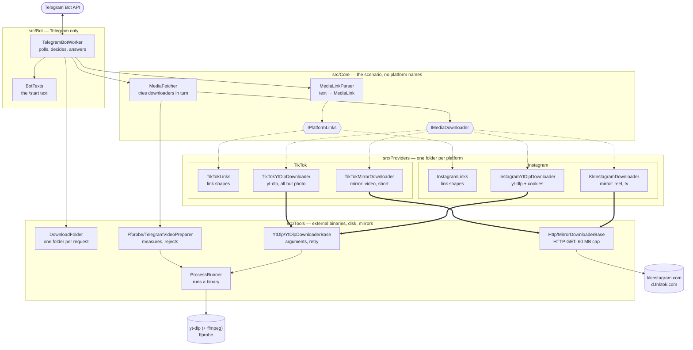
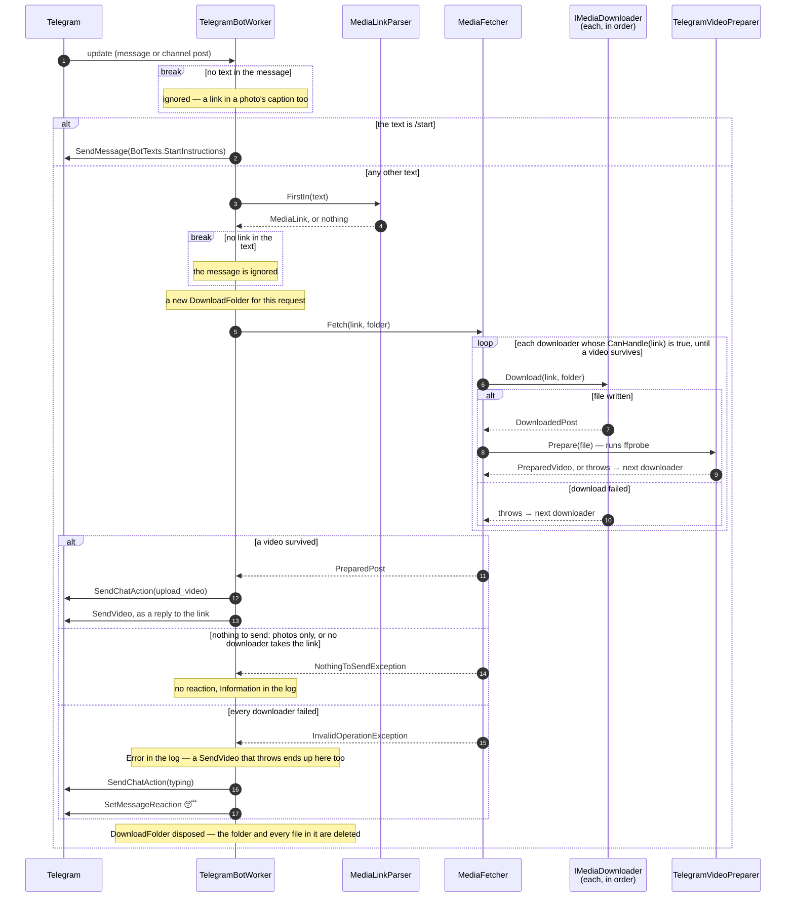

# Architecture

A map of the bot: which pieces exist, what each one does, who calls whom, and where to open the code
for each step of a request. The *why* behind the decisions lives in [readme.md](readme.md) and
[CLAUDE.md](CLAUDE.md); this file only answers "where is it".

The diagrams are Mermaid. GitHub renders them as they are. In Rider or another JetBrains IDE,
switch on Mermaid in *Settings → Languages & Frameworks → Markdown → Markdown Extensions*.

## Components

Three kinds of arrow:

- `──▶` calls or uses;
- `┄┄▶` an interface and the classes behind it — the downloaders through their base classes;
- `══▶` inherits from a base class.

These are calls, not the layer rules. `Providers/` and `Tools/Http`, `Tools/YtDlp`, `Tools/Ffprobe`
also depend upwards on the contracts and records in `Core/`. The rules themselves are in
[CLAUDE.md](CLAUDE.md) and are enforced by [ArchitectureTests](tests/ArchitectureTests.cs).

Not drawn, to keep the picture readable: each downloader also asks its platform's `*Links` for the
shape of a link inside `CanHandle`.

## What each part does

One row per class, grouped as the folders are. In a rendered view the name opens the file.

**`src/Bot/`** — the only layer that knows Telegram.

| Component                                         | Does                                                                  |
|---------------------------------------------------|-----------------------------------------------------------------------|
| [TelegramBotWorker](src/Bot/TelegramBotWorker.cs) | Polls Telegram, tells `/start` from a link, sends the video or reacts |
| [BotTexts](src/Bot/BotTexts.cs)                   | The `/start` instructions, one text per language                      |
| [LocalizedText](src/Bot/LocalizedText.cs)         | Picks the language by the client's `language_code`, English otherwise |

**`src/Core/`** — the scenario and its contracts. No platform is named here.

| Component                                                    | Does                                                                 |
|--------------------------------------------------------------|----------------------------------------------------------------------|
| [MediaLinkParser](src/Core/MediaLinkParser.cs)               | Finds the first recognized link in a text, asking platforms in order |
| [IPlatformLinks](src/Core/IPlatformLinks.cs)                 | One platform's link shapes: finds that platform's link in a text     |
| [MediaFetcher](src/Core/MediaFetcher.cs)                     | Tries the downloaders in order and returns the first sendable video  |
| [IMediaDownloader](src/Core/IMediaDownloader.cs)             | `CanHandle` a link, `Download` it into a folder: files, or a throw   |
| [NothingToSendException](src/Core/NothingToSendException.cs) | No video behind the link: the request ends without a reaction        |
| [MediaLink](src/Core/MediaLink.cs)                           | A recognized link: URL, platform, post id                            |
| [DownloadedPost](src/Core/DownloadedPost.cs)                 | The files one downloader wrote                                       |
| [PreparedPost](src/Core/PreparedPost.cs)                     | The videos that can be sent, each a `PreparedVideo`                  |
| [PreparedVideo](src/Core/PreparedVideo.cs)                   | A sendable file with its display size and duration                   |

**`src/Providers/`** — one folder per platform.

| Component                                                                       | Does                                                             |
|---------------------------------------------------------------------------------|------------------------------------------------------------------|
| [InstagramLinks](src/Providers/Instagram/InstagramLinks.cs)                     | Instagram link shapes; whether a link holds exactly one video    |
| [KkInstagramDownloader](src/Providers/Instagram/KkInstagramDownloader.cs)       | The kkinstagram mirror; takes `/reel/`, `/reels/`, `/tv/` only   |
| [InstagramYtDlpDownloader](src/Providers/Instagram/InstagramYtDlpDownloader.cs) | yt-dlp with the Instagram cookies; takes every Instagram link    |
| [TikTokLinks](src/Providers/TikTok/TikTokLinks.cs)                              | TikTok link shapes, and which `TikTokLinkShape` a link is        |
| [TikTokMirrorDownloader](src/Providers/TikTok/TikTokMirrorDownloader.cs)        | The tnktok mirror; takes video and short links                   |
| [TikTokYtDlpDownloader](src/Providers/TikTok/TikTokYtDlpDownloader.cs)          | yt-dlp without cookies; takes every TikTok link but a photo post |
| `*ServiceCollectionExtensions`                                                  | Registers a platform: its links, then its downloaders in order   |
| `*Options`                                                                      | That platform's settings, read from `src/appsettings.json`       |

**`src/Tools/`** — what drives an external binary, the disk or a mirror.

| Component                                                           | Does                                                               |
|---------------------------------------------------------------------|--------------------------------------------------------------------|
| [DownloadFolder](src/Tools/DownloadFolder.cs)                       | A folder per request; disposing it deletes everything inside       |
| [MirrorDownloaderBase](src/Tools/Http/MirrorDownloaderBase.cs)      | One HTTP GET: bot User-Agent, `video/*` check, 60 MB cap           |
| [YtDlpDownloaderBase](src/Tools/YtDlp/YtDlpDownloaderBase.cs)       | yt-dlp arguments, the retry, the cookies session copy              |
| [YtDlpFailedException](src/Tools/YtDlp/YtDlpFailedException.cs)     | Reads yt-dlp's errors: worth a retry? a post without video?        |
| [TelegramVideoPreparer](src/Tools/Ffprobe/TelegramVideoPreparer.cs) | Runs ffprobe, measures the video, refuses what Telegram can't send |
| [FfprobeOutput](src/Tools/Ffprobe/FfprobeOutput.cs)                 | ffprobe's JSON, its oddities decoded                               |
| [ProcessRunner](src/Tools/ProcessRunner.cs)                         | Runs a binary: argument list, timeout, kills the process tree      |

**Composition and guards**

| Component                                       | Does                                                                        |
|-------------------------------------------------|-----------------------------------------------------------------------------|
| [Program.cs](src/Program.cs)                    | Composes the layers, registers the platforms in order, serves `GET /health` |
| [ArchitectureTests](tests/ArchitectureTests.cs) | Fails the tests when a layer reaches for one it must not                    |

## One request

A message arrives. What follows, down to the three ways a link can end:

## Which downloader takes which link

`MediaFetcher` asks the mirror first and yt-dlp second, skipping any whose `CanHandle` says no. The
first one whose file passes `ffprobe` wins. Either downloader of a platform can be switched off in
configuration, but not both — the app refuses to start.

| Link                                                    | Mirror      | yt-dlp |
|---------------------------------------------------------|-------------|--------|
| Instagram `/reel/`, `/reels/`, `/tv/`                   | kkinstagram | yes    |
| Instagram `/p/`: a photo, a carousel or a video         | —           | yes    |
| TikTok `/@user/video/`, `/share/video/`                 | tnktok      | yes    |
| TikTok short: `vm.`/`vt.tiktok.com/<code>`, `/t/<code>` | tnktok      | yes    |
| TikTok legacy: `/embed/<id>`, `/v/<id>.html`            | —           | yes    |
| TikTok `/@user/photo/`, `/share/photo/`                 | —           | —      |

A `/photo/` link is one nobody takes: there is nothing to send, and the bot leaves no reaction.
A `/p/` post goes to yt-dlp alone, and one that turns out to hold only photos ends the same way.

## Where to look

The component is in the table above; this says which method to open.

| I want to understand…                        | Open                                                         |
|----------------------------------------------|--------------------------------------------------------------|
| how a message is handled                     | `TelegramBotWorker.HandleUpdate`, then `HandleMediaRequest`  |
| when the bot reacts and when it stays silent | `TelegramBotWorker.HandleMediaRequest`, `MediaFetcher.Fetch` |
| which links are recognized                   | `[GeneratedRegex]` in `InstagramLinks`, `TikTokLinks`        |
| which downloader takes a link                | `CanHandle` in each downloader                               |
| the fallback between downloaders             | `MediaFetcher.Fetch`, `PrepareWhatIsSendable`                |
| yt-dlp arguments, and what counts as success | `YtDlpDownloaderBase.BuildArguments`, `RunYtDlp`             |
| when yt-dlp is retried, and when it is not   | `YtDlpDownloaderBase.Download`, `YtDlpFailedException`       |
| Instagram cookies                            | `InstagramYtDlpDownloader` constructor, `PrepareCookiesFile` |
| why a file is refused before sending         | `TelegramVideoPreparer.Prepare`                              |
| the order of platforms and of downloaders    | `Program.cs`, then `AddInstagram` and `AddTikTok`            |
| settings                                     | `src/appsettings.json`, the `*Options` classes               |
| when files are deleted                       | `DownloadFolder.Dispose`, `DeleteLeftovers` at startup       |
| `GET /health`                                | `MapGet("/health")` in `Program.cs`                          |
